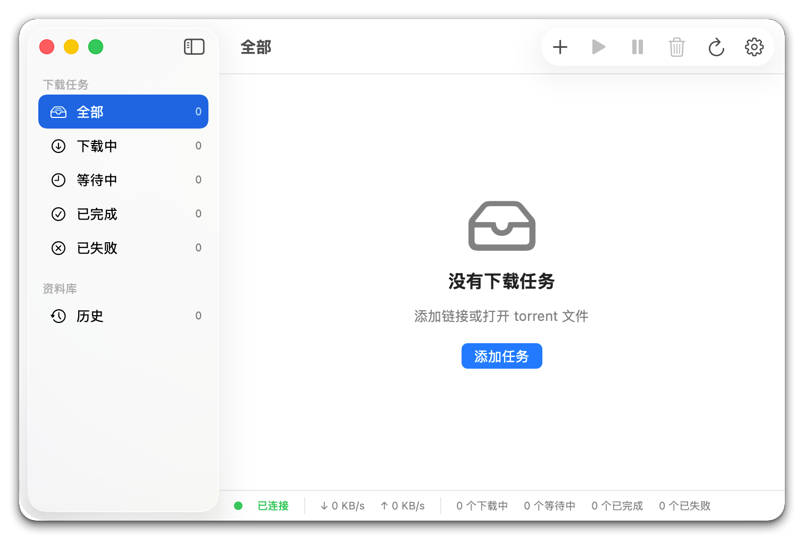

# AriaFlow

<p align="center">
  
</p>

[中文](#中文) | [English](#english)

<p align="center">
  
</p>

## 中文

macOS 原生 SwiftUI 下载客户端，内置 `aria2-next`，支持 HTTP/HTTPS、磁力链接、ED2K、Torrent。

- 下载队列、历史、筛选、菜单栏速度、Dock 进度
- 保存位置、并发、分片、连接数、限速
- BT Peer Blocklist 链接加载（本地缓存后生效）
- 本地 JSON-RPC，Apple Silicon / Intel 双架构 sidecar

**要求：** macOS 14+（macOS 26 启用 Liquid Glass）；源码构建需 Xcode 26 / Swift 6.2。

**安装：** 从 [Releases](https://github.com/FateLightX/AriaFlow/releases) 下载 ZIP 与 `.sha256`。当前为 ad-hoc 签名、未公证；若被 Gatekeeper 拦截，在 Finder 中 Control-点击 `AriaFlow.app` → 打开。

```bash
swift build --disable-sandbox
scripts/package_app.sh
scripts/verify_release.sh
```

产物：`dist/AriaFlow.app`、`dist/AriaFlow-<version>.zip` 及校验文件。Sidecar 说明见 [docs/SIDECAR.md](docs/SIDECAR.md)。

反馈前请阅读 [CONTRIBUTING.md](CONTRIBUTING.md)；勿提交私密链接或 RPC Secret。安全问题见 [SECURITY.md](SECURITY.md)。

## English

Native SwiftUI download client for macOS with bundled `aria2-next` for HTTP/HTTPS, magnet, ED2K, and torrent.

- Queue, history, filters, menu bar speed, Dock progress
- Save path, concurrency, splits, connections, speed limits
- BT peer blocklist via URL (cached locally)
- Local JSON-RPC; Apple Silicon and Intel sidecars

**Requirements:** macOS 14+ (Liquid Glass on macOS 26); Xcode 26 / Swift 6.2 to build.

**Install:** Download the ZIP and `.sha256` from [Releases](https://github.com/FateLightX/AriaFlow/releases). Builds are ad-hoc signed, not notarized. If Gatekeeper blocks launch, Control-click `AriaFlow.app` → Open.

```bash
swift build --disable-sandbox
scripts/package_app.sh
scripts/verify_release.sh
```

Artifacts: `dist/AriaFlow.app`, `dist/AriaFlow-<version>.zip`, and checksum. Sidecar notes: [docs/SIDECAR.md](docs/SIDECAR.md).

See [CONTRIBUTING.md](CONTRIBUTING.md) and [SECURITY.md](SECURITY.md). Do not include private URLs or RPC secrets in reports.

## Docs

- [AGENTS.md](AGENTS.md) · [Architecture](docs/ARCHITECTURE.md) · [Sidecar](docs/SIDECAR.md) · [Release checklist](docs/RELEASE_CHECKLIST.md) · [Changelog](CHANGELOG.md)

## Acknowledgements

[aria2-next](https://github.com/AnInsomniacy/aria2-next) · [motrix-next](https://github.com/AnInsomniacy/motrix-next)

## License

AriaFlow is [MIT](LICENSE). Bundled `aria2-next` is GPL-2.0; see [THIRD_PARTY_NOTICES.md](THIRD_PARTY_NOTICES.md).
